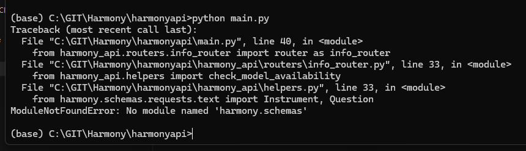

# Workshop FAQs


## What do I need to bring?
Please bring your own laptop and anything you need to feel comfortable on that day. We will be providing wifi, snacks, food and drinks including water, tea and juice.

## What happens to the code we produce in the workshop?
Any code produced and submitted to the main Harmony repository will be public under MIT license.

## Troubleshooting the API repo submodules after git clone

After you have cloned the repository at https://github.com/harmonydata/harmonyapi, if the folder inside called `harmony` is empty, or at any point you get an error like the below, please check you have cloned with `--recurse-submodules` as below:



```
git clone --recurse-submodules https://github.com/harmonydata/harmonyapi.git
```

You can also download the entire API repo from https://harmonyapistorage.z33.web.core.windows.net/harmonyapi.zip
