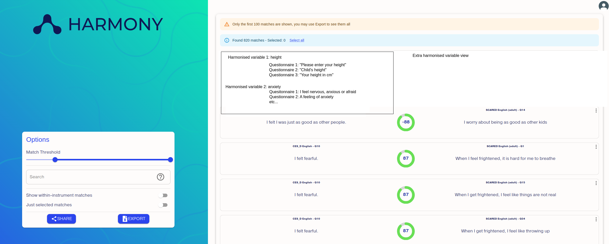

# Harmony Workshop at AI UK 2025

10am-12pm on Monday 17 March 2025 at the Alan Turing Institute, https://ai-uk.turing.ac.uk/

* [FAQs here](./FAQs.md)
* [Developer guide](https://harmonydata.ac.uk/developer-guide/)
* [Guide on contributing to Harmony](https://harmonydata.ac.uk/open-source-for-social-science/contributing-to-harmony-nlp-project/)

## Challenges for workshop

1. PDF parsing - [see PDF parsing challenge](https://doxaai.com/competition/harmony-parsing)
2. Improve matching of items by semantic similarity - [see matching challenge](https://doxaai.com/competition/harmony-matching)
3. Add new data sources to Harmony Discovery
4. Add new sources to Harmony
5. Identify topics of items in Discovery
6. Deduplicate items if they come from multiple sources
* Plus any ideas you might have! 

We have some UX issues that could be fixed - see [UX testing report](./UX%20Notes%20on%20Harmony%20Tool.pdf).

Other ideas requested by research psychologists: can we add to the export, groups of similar items? E.g. everything to do with height across 5 studies? Perhaps this could also be another view in the visualisation in the tool.

# Videos about Harmony

Short demo: https://www.youtube.com/watch?v=cEZppTBj1NI
Presentation at Melbourne Children's LifeCourse Initiative seminar: https://www.youtube.com/watch?v=ZPY-fPsVIE4

# Installing Harmony

You can use Windows, Linux or Mac. We have made some videos to help you install Python and Harmony:

🎬[Video for Windows](https://www.youtube.com/watch?v=Okk8tUMDr6g) · 🎬 [Video for Linux/Mac](https://www.youtube.com/watch?v=enWh0-4I0Sg) · 🎬 [Video on how to install the front end locally](https://youtu.be/1xp3Uh6dptg)

Here are the steps to get started:

* First clone the repository from Git. If you're not familiar with Git and Github, we recommend you watch a tutorial on Git first (example: https://www.youtube.com/watch?v=USjZcfj8yxE)
* Install Python 3.11
* Install Pycharm
* Install Jupyter Notebooks
* Run the [example Colab notebook](https://colab.research.google.com/github/harmonydata/harmony/blob/main/Harmony_example_walkthrough.ipynb)

* We recommend Anaconda and Jupyter Notebook
* Then you can do `pip install harmonydata` to install Harmony once Python has been installed.

# Pushes and commits

We try to keep our code clean and consistent. If one person uses spaces and another uses tabs, it's hard to manage it and keep track of code changes. Please follow the general principles for consistency.

When developing and pushing changes,

* Please use [PEP-8 Linter](https://pypi.org/project/pep8/) - this is a set of rules of how many whitespace characters are allowed in a line, and in general provides consistency for formatting of human readable code and comments. If everyone formats their code differently, things become hard to manage as it's hard to track if a change is a functional change, or a formatting change. Imagine if a newspaper article switched between British and American spelling every sentence and between formal tone and textspeak! Let's keep things consistent!
* Please run unit tests before pushing. We use test driven development. That means that every commit gets tested automatically by Github and will get a green tick or red cross if the tests pass or fail. All the repos have tests in a folder called `tests` and you can run them on your computer and Github actions will run them when you commit. They will tell you if you break any functionality.
* Check your PR hasn’t got any extra files made by your IDE that shouldn’t be committed, such as .vscode. It's a common mistake for beginners to bulk commit the entire contents of a directory including files which are not part of the project. For example, Mac puts extra hidden files inside folders when you open them in the file browser. Try not to let them clutter our code base. They make code hard to manage and in some cases can break the tool.
